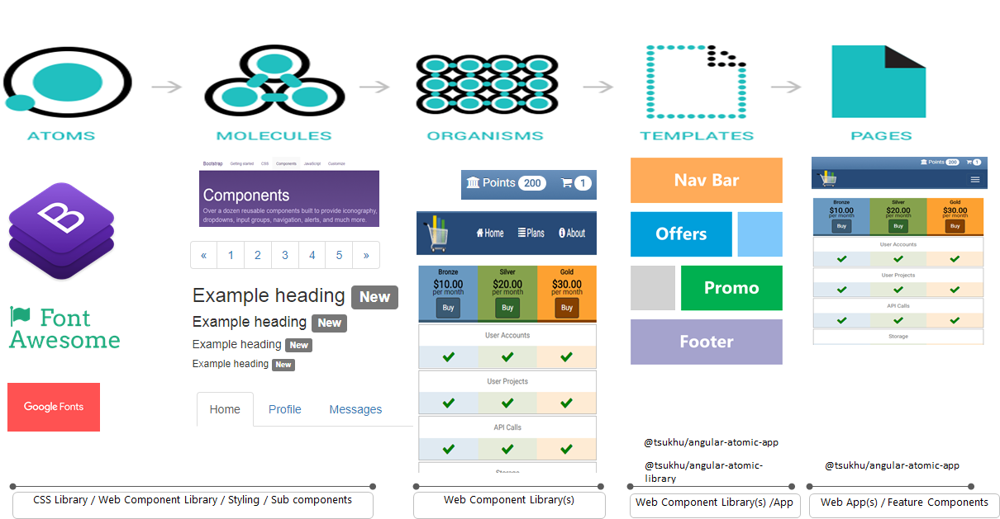
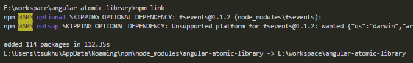
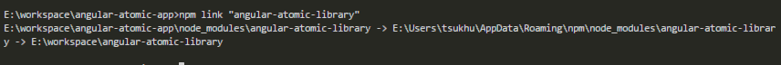

# Angular Atomic App

This is a sample for building an Angular 5 web app based on the atomic web design principles and best of breed industry design patterns.

# Why Atomic ?

* The concept is based on Brad Frost "Atomic Web Design"
* Atoms / Molecules - Bootstrap , Google Fonts , Font Awesome
* Organisms / Templates - Built as a separate project and then used in the main application [Angular Atomic Library](https://github.com/ERS-HCL/angular-atomic-library)

<p align="center">
    
</p>

# Atomic Library Dependency

* This project is based on the angular atomic library so we need to "link" to that (for dev mode). Once the library and the app is ready you can publish the angular-atomic-library to an npm registry and then use "npm install angular-atomic-library --save" to import the latest version.

## Using `npm link`

Check out and build the [angular-atomic-library](https://github.com/ERS-HCL/angular-atomic-library.git)
```bash
git clone https://github.com/ERS-HCL/angular-atomic-library.git
cd angular-atomic-library
npm install
```
In your library projects (i.e angular-atomic-library) root folder: (Separate Terminal)

```bash
# Create symbolic link
npm link
```

<p align="center">
    
</p>

```bash
# Build library in watch mode
npm build:watch
```

In the **angular-atomic-app** project folder that should consume the library: (Separate Terminal)

The below steps will import your library into your project's source code

```bash
# Link you library to the project
npm link "angular-atomic-library"
```
<p align="center">
    
</p>

```bash
# Build your project
npm start
```

Now, once you update your library source code it will automatically be re-compiled and your project will be re-built so you may see library changes instantly.

# Final Production Build

Production build will require the angular-atomic-library to also be built in production mode (AOT).
In case you are not using an npm registry do the following
* Build the library . Steps given in the library app [README](https://github.com/ERS-HCL/angular-atomic-library/blob/master/README.md)
* Use npm pack to create the packaged module file
```
npm pack
```
* This will create the installable library module named `angular-atomic-library-<VERSION>.tgz`
* In your angular-atomic-app project run the npm install using this package
```
npm install <LIBRARY_FOLDER>/angular-atomic-library-<VERSION>.tgz
```
* There after you can run the production build for the app
```
npm run build:aot
```
# Project Starter
* This app is built on top of the [angular-starter](https://github.com/gdi2290/angular-starter) project

# License
 [MIT](/LICENSE)
